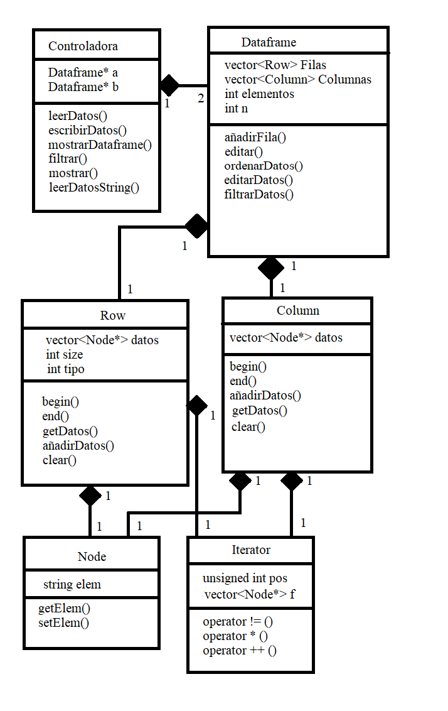

Algoritmos y estructura de datos
================================

Trabajo final
-------------

### Equipo de trabajo
* Andrade Rodríguez, Rafael Andres
* Quispe Calixto, Gino Salvador 
* Villegas Contreras, Jonathan Christian

### Introducción

Tenemos bibliotecas que nos permiten manejar datos de gran magnitud. El problema es manejar de manera eficiente lo mencionado. Muchas veces tenemos millones de registros, pero no se pueden manipular directamente con su extensión. Esto implica mucho costo y tiempo. Como solución, podemos implementar una librería capaz de brindarnos las herramientas para administrar esta información adecuadamente y con base en nuestros aprendizajes relacionados a POO y al uso de estructuras de datos.

### Objetivos

Nuestro objetivo general es construir una biblioteca en c++ con base en los conceptos y a la teoría estudiada a lo largo del curso para proporcionar las herramientas gestión de información y manejarlas eficientemente.

Nuestro objetivo específico es, mediante el análisis de la información solicitada, construir una biblioteca en c++ para el manejo de dataframes, que importe datos, maneje un indexado por columnas, permita seleccionar y acceder a estos elementos, filtre información por columnas, los ordene y los exporte a archivos planos.

### Marco conceptual

_Dataframe:_

Los dataframes son una clase de objetos especiales en R (lenguaje de programación estadístico/matemático). Usualmente cuando se realizan estudios estadísticos sobre un conjunto de objetos de una 'muestra', la información se organiza en una hoja de datos o cuadro de datos (dataframe por su traducción); en la cual cada fila corresponde a un objeto y cada columna a una variable de este mismo. 
Como se puede apreciar su estructura es muy similar a la de una matriz, no obstante, un problema que surge al usar matrices es el solo poder usar valores numéricos, mientras que usando Dataframe podemos usar datos alfanuméricos.

_Árbol_

Es una estructura de dato no lineal, ya que cada elemento apunto a uno o mas elementos del mismo tipo. El elemento que apunta se le conoce como padre, mientras que el elemento apuntado se le conoce como hijo. Todo elemento es hijo de un padre, excepto la raiz, primer elemento de la estructura.

_Árbol Binario_

Un árbol binario es aquel árbol donde cada elemento apunta como máximo a 2 elementos: un hijo derecho y un hijo izquierdo. 

_Árbol Binario de Busqueda_

Árbol binario de búsqueda (ABB), es un árbol binario en el cual, para todo elemento, aquellos elementos que sean mayores a él, se ubican en una rama derecha, mientras los elementos menores en su rama izquierda. Cada elemento se almacena solo una vez, por lo cual no existen elementos que se repitan. 

### Diagrama de clases (alto nivel)

_Dataframe, Row, Column_

### Cronograma de trabajo

Hemos dividido nuestras tareas en tres hitos: 

Hito 1: 

    -Crear repositorio

    -Crear proyecto

    -Editar informe

    -Intro

    -Objetivos

    -Marco conceptual

    -Diagrama de clases

    (Clases: Dataframe, fila, columna, indice, gestor de archivos)

    -Cronograma

Hito 2:

    -Implementar clases

    -Designar dependencia: 

    -Definir métodos
    
    -Definir diagrama de clases de manera general
    
    -Implementar Clase 1 hasta Clase n

    -Diseño de UI (Interfaz) *

    -Diseño de TDA's (Tipos de datos abstractos)

    -TDA 1 (bintree)
    
    -TDA 2 (hashmap)
    
    -TDA 3 (pila)
    
    -Diagrama de componentes

    -Diagrama de clase de segundo nivel (bajo nivel)

Hito 3:

    -Elaboración del video

    -Elaboración del PPT

